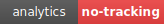
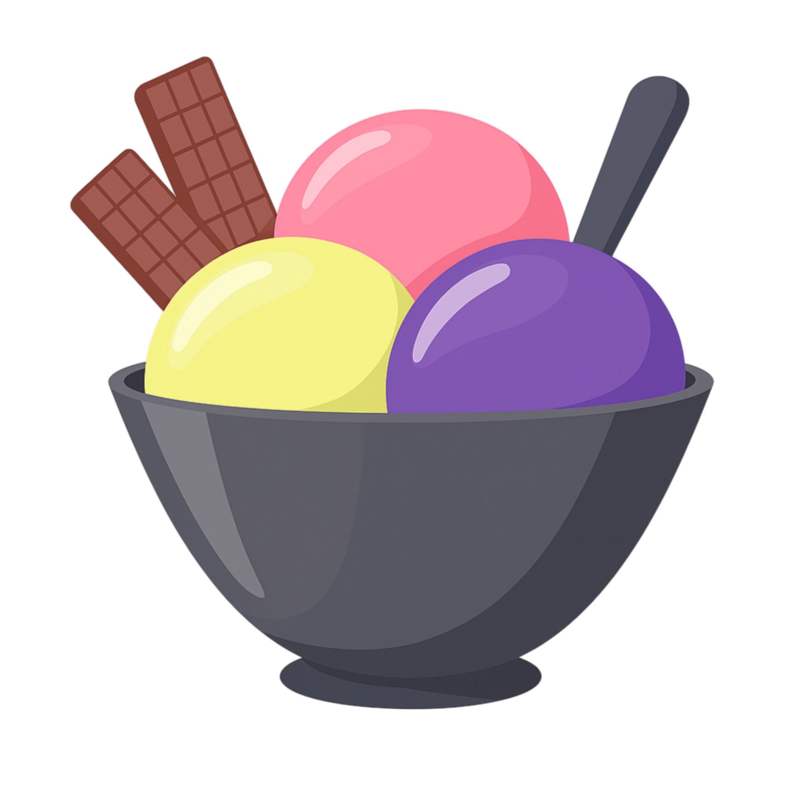
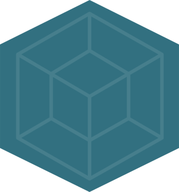
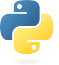
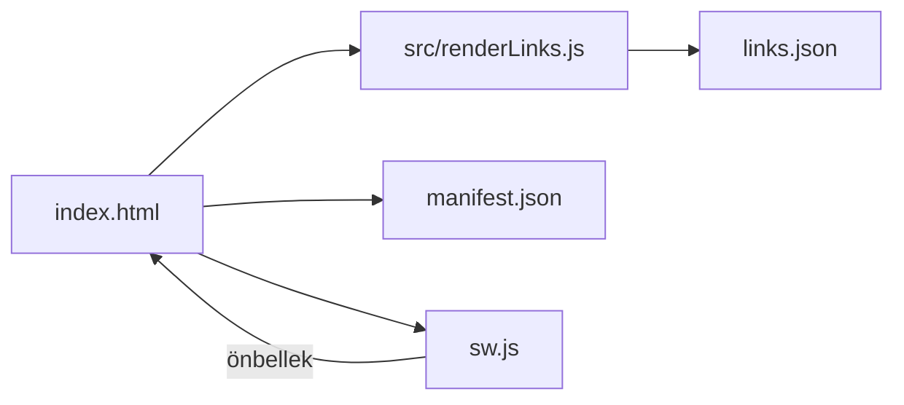

<div align="center">

  

  <br/>

  
  
  
  

  <p><em>Seçilmiş bağlantılar • Tek sayfa • Hızlı PWA</em></p>
</div>

**Öne Çıkanlar**
- **Hızlı arama:** Yazdıkça filtreler, eşleşmeleri vurgular.
- **Önerilenler:** Üstte yıldızlı bağlantılarla hızlı erişim.
- **Koyu/Açık tema:** Tek tıkla görünüm değişimi.
- **Çevrimdışı kullanım:** Servis çalışanı ile içerik önbelleği.
- **PWA:** Telefon ve masaüstüne uygulama olarak eklenir.

**Hızlı Bakış**
- **Ana sayfa:** `index.html`
- **İçerik kaynağı:** `links.json`
- **Görselleştirme:** `src/renderLinks.js`
- **Servis çalışanı:** `sw.js`
- **Manifest:** `manifest.json`

**Ekran Görselleri**
- Aşağıdaki küçük koleksiyon, içerikte yer alan bazı araçların simgeleridir.
  <br/>
  
  
  
  
  
  
  
  
  
  
  

**Nasıl Kullanılır?**
- **Arama:** Üstteki kutuya yazın; sonuçlar anında filtrelenir.
- **Kategoriler:** İlgili başlık altındaki bağlantılara tıklayın; tüm bağlantılar yeni sekmede açılır.
- **Tema:** Sağ üstteki `Tema` seçimiyle Koyu/Açık moda geçin.
- **Önerilenler:** Yıldız simgesiyle işaretlenir, listelerde önce görünür.
- **Kopyalama düğmeleri:** Komut içeren bağlantıların sağ üst köşesinde bir kopyalama düğmesi belirir. Düğmeye tıklayınca komut panonuza kopyalanır, düğme kısa süreliğine kilitlenir ve yükleniyor animasyonu gösterir. Kopyalama başarılıysa düğme yeşile dönerek onay simgesiyle bildirir; hata olduğunda kırmızı uyarı simgesi görünür. Durum simgesi birkaç saniye sonra varsayılan kopyalama simgesine döner ve düğme yeniden kullanılabilir.

**Klavye Kısayolları**
- `/`: Arama kutusuna odaklanır.
- `Esc`: Aramayı temizler, varsayılana döndürür.

**PWA ve Çevrimdışı**
- İlk ziyaretinizde temel dosyalar önbelleğe alınır.
- Sonraki ziyaretlerde yavaş bağlantıda bile hızlı açılır; çevrimdışıyken son içerik gösterilir.
- En güncel içerik için ara ara çevrimiçi ziyaret edin.

**Mimari (Özet)**


**Yerelde Görüntüleme**
- Basit bir yerel sunucu ile çalıştırın (örn. VS Code Live Server, `python -m http.server`).
- Ardından tarayıcıda `http://localhost:PORT/` adresine gidin. Not: `file:///` ile açmak tarayıcı güvenlik kısıtları nedeniyle sorun çıkarabilir.

**Kurulum**
- Node.js 18+ sürümünün kurulu olduğundan emin olun.
- Gerekli bağımlılıkları yüklemek için depo kökünde `npm install` komutunu çalıştırın.

**Geliştirme Akışı**
- `npm run serve`: `links.json` ve `src/` dizinindeki değişiklikleri izleyerek yerel bir geliştirme sunucusu açar.
- `npm run build`: `dist/` klasörüne üretim paketini oluşturur. Komut, statik dosyaları optimize eder ve servis çalışanı için önbellek manifestini günceller.
- `npm run validate`: `links.json` içindeki bağlantı ve kategorileri şemaya göre kontrol eder.
- `npm run check:encoding`: Depodaki dosyaların UTF-8 olduğundan emin olur.
- `npm run ci:validate`: Sürekli entegrasyonda kullanılan birleşik doğrulama komutudur.
- `npm run fix:titles`: Bağlantı başlıklarını tutarlı hale getirmeye yardımcı olan yardımcı araçtır.
- `npm run optimize:svg`: `icon/` ve `docs/` dizinlerindeki SVG dosyalarını SVGO ile sıkıştırır.

**Testler ve Kontroller**
- Kod veya içerik değişikliklerinden sonra `npm run ci:validate` komutunu çalıştırarak şema ve kodlama doğrulamalarının geçtiğinden emin olun.

**Dosya Yapısı (Özet)**
```
byGOG-Lab/
├── dist/            # Üretim çıktıları (build sonrası oluşur)
├── docs/            # README görselleri ve rozetler
├── icon/            # Uygulamada kullanılan SVG simgeler
├── scripts/         # Node.js tabanlı yardımcı betikler
├── src/             # Render mantığı ve UI parçaları
├── index.html       # Ana uygulama kabuğu
├── links.json       # Kategori ve bağlantı verisi
├── manifest.json    # PWA yapılandırması
└── sw.js            # Servis çalışanı
```

**Katkı ve Geri Bildirim**
- Öneri ve düzenlemeler için issue/pull request açabilirsiniz.
- Hızlı geri bildirim için `links.json` üzerinde kategori ve başlık önerilerinde bulunun.
