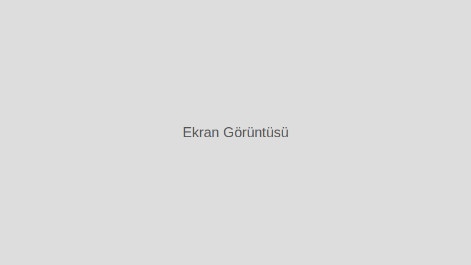

<div align="center">
  <a href="https://bygog.github.io/byGOG-Lab/">
    
  </a>

  <h3 align="center">byGOG Lab</h3>

  <p align="center">
    Kişisel olarak derlenmiş, kullanışlı yazılım ve araçların bir koleksiyonu.
    <br />
    <a href="https://bygog.github.io/byGOG-Lab/"><strong>Siteyi Görüntüle »</strong></a>
    <br />
    <br />
    <a href="https://github.com/byGOG/byGOG-Lab/issues">Hata Bildir</a>
    ·
    <a href="https://github.com/byGOG/byGOG-Lab/issues">Özellik İste</a>
  </p>
</div>

---

## 🚀 Hakkında

byGOG Lab, teknoloji meraklıları ve geliştiriciler için özenle seçilmiş, sık kullanılan ve faydalı bulunan yazılımların, araçların ve web sitelerinin bir araya getirildiği kişisel bir başlangıç sayfasıdır. Bu proje, tüm bu kaynaklara tek bir yerden, hızlı ve kolay bir şekilde erişim sağlamak amacıyla oluşturulmuştur.

## ✨ Öne Çıkan Özellikler

*   **🗂️ Kategorize Edilmiş Bağlantılar:** Tüm bağlantılar, "Windows & Office", "Sistem Araçları & Bakım", "Güvenlik & Gizlilik" gibi mantıksal kategorilere ayrılmıştır.
*   **🔍 Anında Arama:** Sayfa içi arama çubuğu ile istediğiniz yazılımı veya aracı hızlıca bulabilirsiniz.
*   **🎨 Tema Desteği:** Göz zevkinize uygun olarak açık ve koyu tema arasında geçiş yapabilirsiniz.
*   **ℹ️ Detaylı Bilgiler:** Fare ile bağlantıların üzerine gelindiğinde, araçlar hakkında kısa açıklamalar görüntülenir.
*   **⭐ Önerilenler:** Sık kullanılan ve önerilen araçlar için özel bir "Önerilenler" bölümü bulunmaktadır.

## 📸 Örnek Ekran Görüntüsü



## 🛠️ Kullanılan Teknolojiler

*   
*   
*   

## 🔧 Geliştirme

Minify edilmiş dosyaları yeniden oluşturmak için:

```bash
npm install
npm run build
```

Bu komutlar `styles.css` ve `scripts/` altındaki JavaScript dosyalarının küçültülmüş sürümlerini `dist/` klasörüne yazar.

## 🧪 Test

```bash
npm test
```

Bu komut `links.json` dosyasının temel yapısını doğrular.

## 🤝 Katkıda Bulunma

Katkılarınızı bekliyoruz! Başlamak için:

1. Depoyu fork'layın ve yerel ortamınıza klonlayın.
2. Yeni bir dal oluşturun (`git checkout -b feature/yenilik`).
3. Değişikliklerinizi commit'leyin (`git commit -m 'Açıklama'`).
4. Dalı GitHub'a gönderin (`git push origin feature/yenilik`).
5. Açıklayıcı bir Pull Request açın.

### `links.json` Rehberi

- Her bağlantı için `url` ve `name` alanları zorunludur.
- `recommended`, `description`, `icon`, `alt` ve `tags` alanları isteğe bağlıdır.
- Kategoriler `title` ve `links` ya da `subcategories` içermelidir.
- `subcategories` içindeki her öğe `title` ve `links` alanlarına sahip olmalıdır.

## 📝 Lisans

Bu proje MIT Lisansı ile lisanslanmıştır. Daha fazla bilgi için `LICENSE` dosyasına bakın.

## 🙏 Destek

Bu projeyi beğendiyseniz, lütfen bir ⭐ verin!

---

<p align="center">
  byGOG tarafından ❤️ ile yapılmıştır.
</p>
