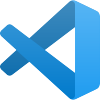

  

   

  
  
  
  

  
<em>Seçilmiş bağlantılar · Tek sayfa · Hızlı PWA</em>

byGOG Lab, Windows ve yazılım araçları için güvenilir bağlantıları tek sayfada bir araya getirir. Aradığınızı hızla bulun, isterseniz komutları tek tıkla kopyalayın, çevrimdışı bile kullanın.

Öne Çıkanlar
- Hızlı arama: Yazdıkça filtreler, eşleşmeleri vurgular.
- Önerilenler: Üstte yıldızlı bağlantılarla hızlı erişim.
- Kopyalama düğmeleri: Winget/PowerShell komutlarını tek tıkla kopyalayın.
- Koyu/Açık tema: Tek tıkla görünüm değişimi.
- Çevrimdışı kullanım: Servis çalışanı ile içerik önbelleği.
- Takip yok: Analitik veya reklam çerezleri kullanılmaz.

Nasıl Kullanılır?
- Arayın: Üstteki kutuya yazın; sonuçlar anında filtrelenir.
- Kategorilere göz atın: Başlıklar altındaki bağlantılara tıklayın; her bağlantı yeni sekmede açılır.
- Önerilenler: Yıldız simgesiyle işaretlenir ve listelerde önce görünür.
- Komutu kopyalayın: Komut içeren bağlantıların sağ üst köşesindeki kopyalama düğmesine tıklayın. Kopyalandığında onay simgesi görünür; hata olursa uyarı simgesi belirir.
- Tema değiştirin: Sağ üstteki Tema seçimiyle Koyu/Açık moda geçin.

Klavye Kısayolları
- `/`: Arama kutusuna odaklanır.
- `Esc`: Aramayı temizler, varsayılan görünüme döner.

PWA ve Çevrimdışı
- İlk ziyaretinizde temel dosyalar önbelleğe alınır.
- Sonraki ziyaretlerde yavaş bağlantıda bile hızlı açılır; çevrimdışıyken son içerik gösterilir.
- En güncel içerik için ara ara çevrimiçi ziyaret edin.

Sık Sorulanlar (SSS)
- Önerilenler neye göre? Güvenilirlik, yaygın kullanım ve pratiklik önceliğimizdir. Yıldızlı öğeler yalnızca bir “başlangıç noktası” önerisidir.
- Bağlantılar güvenli mi? Resmî sayfalar ve bilinen projeler tercih edilir. Yine de indirdiğiniz dosyaları antivirüs ile taramanızı ve imzaları/sağlama değerlerini doğrulamanızı öneririz.
- Kopyaladığım komutlar ne yapar? Winget veya PowerShell komutları ilgili yazılımı kurar/çalıştırır. Yalnızca kaynağından emin olduğunuz komutları kullanın.
- Mobilde uygulama olarak ekleyebilir miyim? Evet. Tarayıcınızın “Ana ekrana ekle”/“Install App” seçeneğini kullanın.

Ekran Görselleri
- Aşağıdaki küçük koleksiyon, içerikte yer alan bazı araçların simgeleridir.
   
  
  
  
  
  
  
  
  
  
  
  

Yerelde Açma (İsteğe Bağlı)
- Depoyu indirin veya ZIP olarak dışa aktarın.
- Basit bir yerel sunucu ile açın (ör. VS Code Live Server, `python -m http.server`).
- Ardından tarayıcıda `http://localhost:PORT/` adresine gidin. Not: `file:///` ile açmak, tarayıcı güvenlik kısıtları nedeniyle sorun çıkarabilir.

Sorumluluk Reddi
- Buradaki bağlantılar bilgilendirme amaçlıdır. Yazılım lisansları ve yerel yasalara uymak kullanıcının sorumluluğundadır.
- Komutları çalıştırmadan önce içeriğini ve kaynağını mutlaka doğrulayın.

Geri Bildirim
- Öneri ve düzeltmeler için issue/pull request açabilirsiniz.
- Hızlı geri bildirim için `links.json` üzerinde kategori ve başlık önerilerinde bulunun.

Geliştiriciler İçin (Kısa Notlar)
- Gereksinim: Node.js 18+
- Kurulum: Depo kökünde `npm install`
- Geliştirme: `npm run serve` – `links.json` ve `src/` izlenir, yerel sunucu açılır.
- Üretim: `npm run build` – `dist/` klasörüne paket çıkar.
- Doğrulama: `npm run validate`, `npm run ci:validate`, `npm run check:encoding`
- Yardımcılar: `npm run fix:titles`, `npm run optimize:svg`

