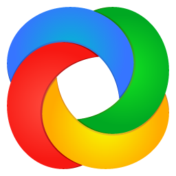

  

   

  
  
  
  

  
<em>Seçilmiş bağlantılar · Tek sayfa · Hızlı PWA</em>

byGOG Lab, Windows ve yazılım araçları için güvenilir bağlantıları tek sayfada bir araya getirir. Aradığınızı hızla bulun, komutları tek tıkla kopyalayın, çevrimdışı bile kullanın.

Öne Çıkanlar
- 🔎 Hızlı arama: Yazdıkça filtreler, eşleşmeleri vurgular.
- ⭐ Önerilenler: Üstte yıldızlı bağlantılarla hızlı erişim.
- 📋 Kopyalama düğmeleri: Winget/PowerShell komutlarını tek tıkla kopyalayın.
- ⚡ Çevrimdışı kullanım: Servis çalışanı ile içerik önbelleği.
- 🛡️ Takip yok: Analitik veya reklam çerezleri kullanılmaz.

Nasıl Kullanılır?
- Arayın: Üstteki kutuya yazın; sonuçlar anında filtrelenir.
- Kategorilere göz atın: Başlıklar altındaki bağlantılara tıklayın; her bağlantı yeni sekmede açılır.
- Önerilenler: Yıldız simgesiyle işaretlenir ve listelerde önce görünür.
- Komutu kopyalayın: Komut içeren bağlantıların sağ üst köşesindeki kopyalama düğmesine tıklayın. Kopyalandığında onay simgesi görünür; hata olursa uyarı simgesi belirir.
- Tema değiştirin: Sağ üstteki Tema seçimiyle Koyu/Açık moda geçin.

Klavye Kısayolları
- `/`: Arama kutusuna odaklanır.
- `Esc`: Aramayı temizler, varsayılan görünüme döner.

PWA ve Çevrimdışı
- İlk ziyaretinizde temel dosyalar önbelleğe alınır.
- Sonraki ziyaretlerde yavaş bağlantıda bile hızlı açılır; çevrimdışıyken son içerik gösterilir.
- En güncel içerik için ara ara çevrimiçi ziyaret edin.

Sık Sorulanlar (SSS)
- Önerilenler neye göre? Güvenilirlik, yaygın kullanım ve pratiklik önceliğimizdir. Yıldızlı öğeler yalnızca bir “başlangıç noktası” önerisidir.
- Bağlantılar güvenli mi? Resmî sayfalar ve bilinen projeler tercih edilir. Yine de indirdiğiniz dosyaları antivirüs ile taramanızı ve imzaları/sağlama değerlerini doğrulamanızı öneririz.
- Kopyaladığım komutlar ne yapar? Winget veya PowerShell komutları ilgili yazılımı kurar/çalıştırır. Yalnızca kaynağından emin olduğunuz komutları kullanın.
- Mobilde uygulama olarak ekleyebilir miyim? Evet. Tarayıcınızın “Ana ekrana ekle”/“Install App” seçeneğini kullanın.

Ekran Görselleri
- Aşağıdaki küçük koleksiyon, içerikte yer alan bazı araçların simgeleridir.
   
  
  
  
  
  
  
  
  
  
  
  

 

Sorumluluk Reddi
- Buradaki bağlantılar bilgilendirme amaçlıdır. Yazılım lisansları ve yerel yasalara uymak kullanıcının sorumluluğundadır.
- Komutları çalıştırmadan önce içeriğini ve kaynağını mutlaka doğrulayın.

Geri Bildirim
- Öneri ve düzeltmeler için issue/pull request açabilirsiniz.
- Kullanıcı deneyimiyle ilgili görüşlerinizi paylaşmanız geliştirmeye yardımcı olur.

 
